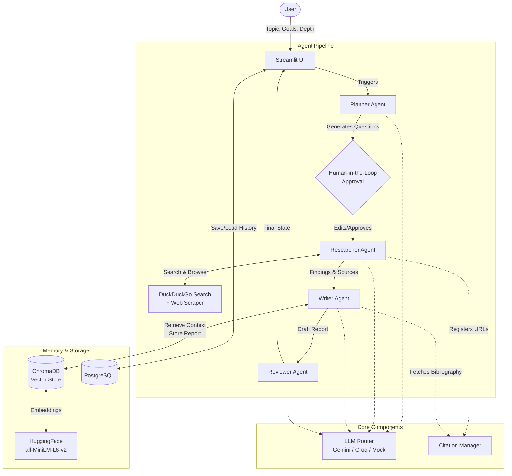

# Architecture

ResearchPilot AI follows a multi-agent architectural pattern where specialized LLM agents pass state sequentially to accomplish a complex research task.

## System Diagram

## Agent Responsibilities

1.  **Planner Agent (`agents/planner.py`)**
    *   **Input:** Topic, Goals, Depth configuration.
    *   **Role:** Acts as the research architect. Deconstructs the topic into a targeted list of search questions. Output scales based on the requested depth (Quick=3, Medium=5, Deep=8).
2.  **Researcher Agent (`agents/researcher.py`)**
    *   **Input:** Research plan (list of questions).
    *   **Role:** The executor. Iterates through the questions, searches the web, fetches full-page content, and synthesizes answers. It registers all visited URLs with the `CitationManager`.
3.  **Writer Agent (`agents/writer.py`)**
    *   **Input:** Research findings, Source list, Past RAG context.
    *   **Role:** The synthesizer. Combines all findings into a cohesive, professional report. It is strictly prompted to use inline citations (e.g., `[1]`) corresponding to the sources provided. It then chunks and stores the final report into the RAG vectorstore.
4.  **Reviewer Agent (`agents/reviewer.py`)**
    *   **Input:** Draft Report.
    *   **Role:** LLM-as-a-Judge. Critiques the report against rubrics (Depth, Accuracy, Citations, Clarity). Outputs structured JSON that the UI renders into scorecards.

## Technology Stack

*   **Frontend**: [Streamlit](https://streamlit.io/) (Python-based reactive UI)
*   **Database (Relational)**: PostgreSQL + SQLAlchemy ORM (Stores research history, metadata, and full state dumps).
*   **Database (Vector/RAG)**: [ChromaDB](https://www.trychroma.com/) (Local persistent vector database).
*   **Embeddings**: HuggingFace `sentence-transformers/all-MiniLM-L6-v2` (via `langchain-huggingface`).
*   **LLM Orchestration**: Direct API calls with custom routing, with optional LangGraph support (`agents/langgraph_workflow.py`).
*   **LLM Providers**: Google Gemini (Primary), Groq LLaMA 3 (Fallback).
*   **Tools**: `ddgs` (DuckDuckGo search), `beautifulsoup4` (DOM parsing), `reportlab` & `python-docx` (Document export).
